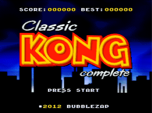

# Retro2K — Modern Browser-Based SNES & PS1 Retro Emulator

A modern, high-performance web-based Super Nintendo (16-bit) and PlayStation 1 (32-bit) emulator built with React 19, TypeScript, Tailwind CSS, and WebAssembly cores (Snes9x & PCSX-ReARMed).



---

## ✨ Highlights & Features

- 🎮 **Full Controller Support**:
  - Direct HTML5 Gamepad API integration for USB & Bluetooth controllers (Xbox Wireless Controller, PlayStation DualSense / DualShock, 8BitDo SN30, Nintendo Switch Pro Controller, and generic DirectInput/XInput pads).
  - **Interactive SVG SNES Controller Visualizer**: Authentic retro gamepad that lights up in real time with glowing neon buttons and an analog thumbstick indicator as you press physical buttons!
  - **Custom Button Remapping**: Rebind any physical controller button or keyboard key directly from the visual gamepad.
  - **Controller Presets**: Instantly toggle between *Nintendo Physical Layout* (recommended for 8BitDo / Switch / SNES pads) and *Xbox Letter Layout*.
  - **Haptic Rumble & Vibration**: Test and feel dual-motor force feedback directly from the browser.
  - **Adjustable Thumbstick Deadzones**: Prevent drifting on older analog sticks.

- 📺 **Modern Retro UI & CRT Shaders**:
  - Sleek glassmorphic dark theme styled with the iconic Super Famicom 4-color diamond gem (Red, Yellow, Blue, Green) or US SNES Lavender/Purple.
  - Authentic hardware-accelerated **CRT scanlines filter** with adjustable opacity slider.
  - Curved CRT vignette, corner tube distortion, and phosphor glow effects.
  - Multiple aspect ratio modes: **4:3 (Authentic CRT TV)**, **8:7 (Pixel-Perfect 1:1 PAR)**, and **Stretch**.
  - Crisp Nearest-Neighbor pixel art scaling vs Smooth Bilinear filtering.

- 💾 **10-Slot Visual Save State Manager**:
  - Instant save states captured with automatic visual screenshot thumbnails.
  - Quick Save with <kbd>F2</kbd> and Quick Load with <kbd>F4</kbd>.
  - Export `.state` files to your computer or import external save files.
  - Persistent save states stored in client-side **IndexedDB**.

- 🔍 **Flexible Viewing Screen Sizes (Larger Screen Options)**:
  - **Standard (Classic)**: `max-w-4xl max-h-[76vh]` — centered framed viewing area.
  - **Large (Spacious 1.5x - Default)**: `max-w-6xl max-h-[88vh]` — substantial, cinematic display filling modern desktop monitors.
  - **Cinema (Max Full Stage)**: `max-w-[96vw] max-h-[92vh]` — near edge-to-edge viewing experience while preserving retro CRT shaders and pixel aspect ratios.
  - Quick cycle button on the bottom **Control Dock** (`1x` / `1.5x` / `MAX`), top-right bezel overlay, or in **Settings**.

- ⏏️ **Authentic "Eject Cartridge" System**:
  - Dedicated **Eject Button** in the top header, floating dock, and TV bezel overlay.
  - Gracefully terminates the running emulation, plays an authentic mechanical spring eject sound effect (`playEjectSound()`), and returns to the home library menu.

- 🕹️ **Drag-and-Drop ROM Loader & Local Library**:
  - Drag and drop any `.smc`, `.sfc`, `.fig`, or `.zip` file directly onto the screen to play immediately.
  - Automatic SNES header inspection (Internal title, LoROM / HiROM mode, cartridge country, and checksum verification).
  - Saved custom ROM shelf backed by IndexedDB for offline play.

- 👾 **Preloaded Homebrew Classics**:
  - *Classic Kong Complete* (Shiru & BubbleZap Games) — 16-bit arcade Donkey Kong remake.
  - *Uwol: Quest for Money* (The Mojon Twins) — fast-paced action pyramid platformer.
  - *N-Warp Daisakusen* (d4s) — legendary SNES multiplayer party brawler.
  - *Skipp and Friends* (Mukunda Johnson) — multi-character puzzle adventure.

- 📱 **Mobile & Tablet Virtual Touch Gamepad**:
  - Translucent on-screen touch controls with multi-touch pointer tracking and haptic vibration.

---

## ⌨️ Controls & Default Key Mappings

### Gamepad Controls (Nintendo Layout)
| SNES Button | Xbox / PS Controller | Nintendo / 8BitDo Controller |
| ----------- | -------------------- | ---------------------------- |
| **D-Pad**   | D-Pad / Left Stick   | D-Pad / Left Stick           |
| **B**       | Bottom (A / Cross)   | Bottom (B)                   |
| **A**       | Right (B / Circle)   | Right (A)                    |
| **Y**       | Left (X / Square)    | Left (Y)                     |
| **X**       | Top (Y / Triangle)   | Top (X)                      |
| **L**       | Left Bumper (LB/L1)  | Left Bumper (L)              |
| **R**       | Right Bumper (RB/R1) | Right Bumper (R)             |
| **Select**  | View / Share / Back  | Minus (-) / Select           |
| **Start**   | Menu / Options       | Plus (+) / Start             |

### Default Keyboard Controls (Arrow Keys + ZX)
| Action | Key |
| ------ | --- |
| **D-Pad Up / Down / Left / Right** | <kbd>↑</kbd> <kbd>↓</kbd> <kbd>←</kbd> <kbd>→</kbd> |
| **B Button** | <kbd>Z</kbd> |
| **A Button** | <kbd>X</kbd> |
| **Y Button** | <kbd>A</kbd> |
| **X Button** | <kbd>S</kbd> |
| **L Shoulder** | <kbd>Q</kbd> |
| **R Shoulder** | <kbd>E</kbd> |
| **Select** | <kbd>Right Shift</kbd> |
| **Start** | <kbd>Enter</kbd> |
| **Quick Save** | <kbd>F2</kbd> |
| **Quick Load** | <kbd>F4</kbd> |
| **Fast Forward (3x)** | <kbd>Space</kbd> (Hold) |
| **Reset Console** | <kbd>R</kbd> |

*(You can switch to the WASD + JK preset anytime in the Controller Visualizer modal or customize any key!)*

---

## 🚀 Getting Started

### Prerequisites
- [Node.js](https://nodejs.org/) (v18 or higher recommended)
- npm or pnpm

### Installation
```bash
# Clone the repository
git clone https://github.com/your-username/snes2k.git
cd snes2k

# Install dependencies
npm install
```

### Development
```bash
npm run dev
```
Open [http://localhost:5173](http://localhost:5173) in your browser.

### Production Build
```bash
npm run build
npm run preview
```

---

## 🛠️ Architecture

```
snes2k/
├── public/
│   └── roms/               # Bundled homebrew ROMs and artwork
├── src/
│   ├── components/
│   │   ├── Header.tsx               # Top glassmorphic bar & status indicator
│   │   ├── EmulatorStage.tsx        # CRT canvas stage, aspect ratio, dropzone
│   │   ├── ControlDock.tsx          # Floating bottom HUD controls dock
│   │   ├── ControllerVisualizer.tsx # Interactive SVG SNES gamepad & mapper
│   │   ├── SaveStateManager.tsx    # 10-slot visual state manager with thumbnails
│   │   ├── RomLibraryModal.tsx     # Game catalogue & ROM upload manager
│   │   ├── TouchGamepad.tsx        # Virtual on-screen touch controls
│   │   ├── SettingsModal.tsx        # Video CRT shader, audio & hotkey settings
│   │   └── Toast.tsx               # Notification toast system
│   ├── services/
│   │   ├── emulator.ts              # Nostalgist / Snes9x WebAssembly lifecycle
│   │   ├── gamepad.ts               # HTML5 Gamepad loop, rumble, and mappings
│   │   ├── keyboard.ts              # Keyboard mapping & hotkey system
│   │   ├── romStorage.ts            # IndexedDB ROM & save state storage
│   │   └── snesHeader.ts            # SNES binary header parser & diagnostics
│   ├── data/
│   │   └── curatedRoms.ts          # Showcase homebrew game catalog
│   ├── types/
│   │   └── emulator.ts             # TypeScript definitions
│   └── utils/
│       └── sfx.ts                  # Web Audio synthesized retro sound effects
```

---

## 📄 License
MIT License.
Homebrew games included are copyright their respective authors and distributed legally under open/freeware licenses.
